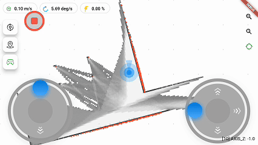

<div align="center">

# ROS Flutter GUI App

[中文](#中文) | [English](README_EN.md)

<p align="center">


<a href="http://qm.qq.com/cgi-bin/qm/qr?_wv=1027&k=mvzoO6tJQtu0ZQYa_itHW7JrT0i4OCdK&authKey=exOT53pUpRG85mwuSMstWKbLlnrme%2FEuJE0Rt%2Fw6ONNvfHqftoWMay03mk1Qi7yv&noverify=0&group_code=797497206"></a>

</p>

<p align="center">


</p>


</div>

## 简介

ROS Flutter GUI App 是一个基于 Flutter Flame 游戏框架开发的跨平台 ROS 机器人人机交互界面，支持 ROS1/ROS2，可运行于 Android、iOS、Web、Linux、Windows 等多个平台。通过 rosbridge websocket 实现与 ROS 系统的通信。

### 主要特性

- 🌟 跨平台支持 - Android、iOS、Web、Linux、Windows
- 🤖 支持 ROS1/ROS2 
- 🗺️ 地图显示与导航功能
- 📹 相机图像显示
- 🎮 机器人遥控功能
- 🔋 电池状态监控
- 📍 多点导航任务
- 🛠️ 高度可配置

### 演示




## 功能列表

| 功能           | 状态 | 备注                  |
| -------------- | ---- | --------------------- |
| ROS1/ROS2通信  | ✅    |                       |
| 地图显示       | ✅    |                       |
| 机器人位置显示 | ✅    |                       |
| 速度控制       | ✅    |                       |
| 重定位         | ✅    |                       |
| 单点/多点导航  | ✅    |                       |
| 规划轨迹显示   | ✅    |                       |
| 电池监控       | ✅    |                       |
| 相机显示       | ✅    | 需要 web_video_server |
| 地图编辑       | ✅    |                 |
| 拓扑地图       | ✅    |                 |
| 诊断信息显示    | ✅    | /diagnostics topic制表显示及错误Toast弹窗 |

## 快速开始

### 下载安装包

从 [Release页面](https://github.com/chengyangkj/ROS_Flutter_Gui_App/releases) 下载对应平台的最新版本:

- Windows: `ros_flutter_gui_app_windows.zip`
- Linux: `ros_flutter_gui_app_linux.tar.gz`
- Android: `ros_flutter_gui_app_android.apk`
- Web: `ros_flutter_gui_app_web.tar.gz`

### 环境要求

#### ROS环境

- ROS1 (Melodic/Noetic) 或 ROS2 (Foxy/Galactic/Humble)
- rosbridge_suite
- web_video_server (可选,用于相机显示功能)

#### 安装依赖

**ROS1**

```bash
sudo apt install ros-${ROS_DISTRO}-rosbridge-suite
sudo apt install ros-${ROS_DISTRO}-web-video-server  # 可选
```

**ROS2**

```bash
sudo apt install ros-${ROS_DISTRO}-rosbridge-suite
# web_video_server需要从源码编译
cd ~/ros2_ws/src
git clone https://github.com/RobotWebTools/web_video_server.git
cd ~/ros2_ws
colcon build
```

### 平台特定说明

#### Web版本部署

1. 解压web版本压缩包
2. 使用Python快速启动HTTP服务:
```bash
cd ros_flutter_gui_app_web
python -m http.server 8000
```
3. 访问 `http://localhost:8000`

#### Android版本

直接安装APK文件即可。

#### Linux/Windows版本

解压后运行可执行文件即可。

### 配置

1. 启动 rosbridge:

```bash
# ROS1
roslaunch rosbridge_server rosbridge_websocket.launch

# ROS2
ros2 launch rosbridge_server rosbridge_websocket_launch.xml
```

2. 运行应用并配置连接参数

详细使用说明参见：[使用说明](docs/usage.md) 

## Star History

<picture>
  <source media="(prefers-color-scheme: dark)" srcset="https://api.star-history.com/svg?repos=chengyangkj/Ros_Flutter_Gui_App&type=Timeline&theme=dark" />
  <source media="(prefers-color-scheme: light)" srcset="https://api.star-history.com/svg?repos=chengyangkj/Ros_Flutter_Gui_App&type=Timeline" />
  
</picture>

## 贡献指南

欢迎提交 Issue 和 Pull Request。详见 [贡献指南](CONTRIBUTING.md)。

## 致谢

- [ros_navigation_command_app 参考界面显示效果](https://github.com/Rongix/ros_navigation_command_app)
- [roslibdart ros通信库](https://pub.dev/packages/roslibdart)

## 许可证

本项目采用 [CC BY-NC-SA 4.0](LICENSE) 许可证。
