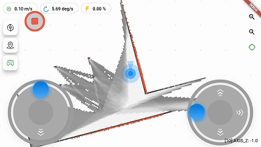

<div align="center">

# ROS Flutter GUI App

[中文](README.md) | [English](#english)

<p align="center">


<a href="http://qm.qq.com/cgi-bin/qm/qr?_wv=1027&k=mvzoO6tJQtu0ZQYa_itHW7JrT0i4OCdK&authKey=exOT53pUpRG85mwuSMstWKbLlnrme%2FEuJE0Rt%2Fw6ONNvfHqftoWMay03mk1Qi7yv&noverify=0&group_code=797497206"></a>
</p>

<p align="center">


</p>

</div>

## Introduction

ROS Flutter GUI App is a cross-platform ROS robot human-machine interface developed with Flutter, supporting both ROS1/ROS2. It can run on Android, iOS, Web, Linux, Windows and other platforms. **In this monorepo build**, map/tiles and robot streaming typically go through the bundled **backend** (HTTP + WebSocket protobuf), not only rosbridge; see the Chinese [README.md](README.md) for the full architecture.

### SSH (quick commands & terminal)

After connecting to the backend in the app, you can use **SSH quick commands** and an **SSH shell**. The client opens **`/ws/ssh`** on the same host/port as HTTP; the backend bridges to `sshd` using **`gui_app_settings.json`** (via **`/api/settings`**). Each quick command can enable **sudo**: the app runs  
`echo '<SSH password>' | sudo -S sh -c '<command>'`  
on the remote host. Use **HTTPS/WSS** in production. Details and caveats are documented in [README.md](README.md) §4.1 (Chinese). In other deployments, communication with ROS may use rosbridge WebSocket instead.

### Key Features

- 🌟 Cross-platform support - Android, iOS, Web, Linux, Windows
- 🤖 Support for ROS1/ROS2
- 🗺️ Map display and navigation
- 📹 Camera image display
- 🎮 Robot remote control
- 🔋 Battery status monitoring
- 📍 Multi-point navigation
- 🛠️ Highly configurable

### Demo




## Feature List

| Feature                       | Status | Note                      |
| ----------------------------- | ------ | ------------------------- |
| ROS1/ROS2 Communication       | ✅      |                           |
| Map Display                   | ✅      |                           |
| Robot Position Display        | ✅      |                           |
| Speed Control                 | ✅      |                           |
| Relocation                    | ✅      |                           |
| Single/Multi-point Navigation | ✅      |                           |
| Path Planning Display         | ✅      |                           |
| Battery Monitoring            | ✅      |                           |
| Camera Display                | ✅      | Requires web_video_server |
| Map Editing                   | ❌      | In development            |
| Topological Map               | ❌      | Planned                   |

## Quick Start

### Installation

1. Download the installation package for your platform from [Release](https://github.com/chengyangkj/ROS_Flutter_Gui_App/releases)

2. Install ROS dependencies:

```bash
# ROS1
sudo apt install ros-${ROS_DISTRO}-rosbridge-suite

# ROS2
sudo apt install ros-${ROS_DISTRO}-rosbridge-suite
```

### Configuration

1. Launch rosbridge:

```bash
# ROS1
roslaunch rosbridge_server rosbridge_websocket.launch

# ROS2
ros2 launch rosbridge_server rosbridge_websocket_launch.xml
```

2. Run the application and configure connection parameters

## Detailed Documentation

- [Installation Guide](docs/installation_EN.md) - Installation steps and environment configuration for each platform
- [Configuration Guide](docs/configuration_EN.md) - Detailed parameter configuration and default values
- [User Guide](docs/usage_EN.md) - Software functionality instructions and best practices

## Star History

<picture>
  <source media="(prefers-color-scheme: dark)" srcset="https://api.star-history.com/svg?repos=chengyangkj/Ros_Flutter_Gui_App&type=Timeline&theme=dark" />
  <source media="(prefers-color-scheme: light)" srcset="https://api.star-history.com/svg?repos=chengyangkj/Ros_Flutter_Gui_App&type=Timeline" />
  
</picture>

## Contributing

Issues and Pull Requests are welcome. See [Contributing Guide](CONTRIBUTING.md) for details.

## Acknowledgments

- [ros_navigation_command_app](https://github.com/Rongix/ros_navigation_command_app)
- [roslibdart](https://pub.dev/packages/roslibdart)
- [matrix_gesture_detector](https://pub.dev/packages/matrix_gesture_detector)

## License

This project is licensed under [CC BY-NC-SA 4.0](LICENSE).
