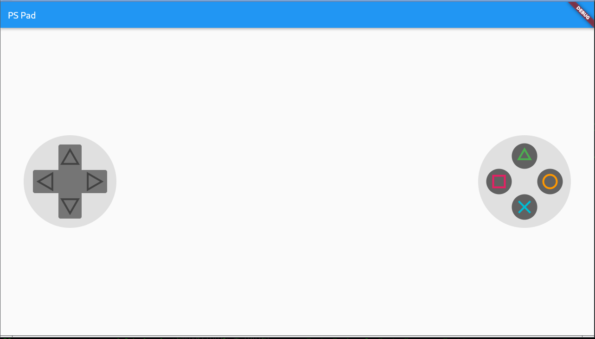

# roslibdart

The is a fork of the original roslib by Eternali Conrad Heidebrecht (@Eternali), Artur Rymarz (@artrmz), TimWhiting Tim Whiting (@TimWhiting). roslibdart is a library for communicating to a ROS node over websockets with rosbridge. It is heavily influenced by roslibjs and follows the same structure. This fork is an effort to update the library and make it compatible to null safety, dart2 and ros2.

## List of feature implementation statuses (essentially a list of features required to reach roslibjs's level)
- [X] Core:
  - [x] ROS connection object
  - [x] Topic object (subscribe, unsubscribe, publish, advertise, unadvertise)
  - [x] Service object (call, advertise, unadvertise)
  - [x] Request object (provides typing and naming to any potential ROS request)
  - [x] Param object (get, set, delete)


## Usage
### Install rosbridge
You can either
```
# install using apt-get
sudo apt-get install ros-foxy-rosbridge-server
#  or you can clone from github
cd ros_ws/src
git clone https://github.com/RobotWebTools/rosbridge_suite
cd ..
colcon build
```
### Run ros bridge
```
cd ros_ws
source install/local_setup.bash
ros2 launch rosbridge_server rosbridge_websocket_launch.xml
```
## Testing publisher

### Demostration: running ros publisher and roslibdart subscriber
```
# Assume ros_ws is your workspace
cp -r rospackage/* ~/ros_ws/src/
cd ~/ros_ws
colcon build
source install/local_setup.bash
ros2 run tutorial publisher
```

```
cd example/subscriber
flutter run -d linux
```
### Example code of using roslibdart to subscribe
```
ros = Ros(url: 'ws://127.0.0.1:9090');
chatter = Topic(ros: ros, name: '/topic', type: "std_msgs/String", reconnectOnClose: true, queueLength: 10, queueSize: 10);
ros.connect();
await chatter.subscribe(subscribeHandler);

Future<void> subscribeHandler(Map<String, dynamic> msg) async {
  msgReceived = json.encode(msg);
  setState(() {});
}
```


## Testing subscriber
### Demostration: running ros subscriber and roslibdart publisher
```
ros2 run tutorial subscriber
```

```
cd example/publisher
flutter run -d linux
```
### Example code of using roslibdart to Publish 
```
ros = Ros(url: 'ws://127.0.0.1:9090');
chatter = Topic(ros: ros, name: '/topic', type: "std_msgs/String", reconnectOnClose: true, queueLength: 10, queueSize: 10);
ros.connect();
Map<String, dynamic> json = {"data": msgToPublished.toString()};
await chatter.publish(json);
```

## Testing call 
### Demostration: running roslibdart caller and ros service
```
ros2 run tutorial service
```

```
cd example/caller
flutter run -d linux
```
### Example code of using roslibdart to call a service 
```
ros = Ros(url: 'ws://127.0.0.1:9090');
service = Service(name: 'add_two_ints', ros: ros, type: "tutorial_interfaces/AddTwoInts");
ros.connect();
Map<String, dynamic> json = {"a": 1, "b": 2};
Map<String, dynamic> result = await service.call(json);
msgToPublished = result['sum'];
```


## Testing providing service
### Demostration: running roslibdart service and ros caller
```
cd example/service
flutter run -d linux
```

```
ros2 run tutorial caller 2 3
```
### Example code of using roslibdart to provide service
```
ros = Ros(url: 'ws://127.0.0.1:9090');
service = Service(name: 'add_two_ints', ros: ros, type: "tutorial_interfaces/AddTwoInts");
ros.connect();
await service.advertise(serviceHandler);

Future<Map<String, dynamic>>? serviceHandler(Map<String, dynamic> args) async {
  Map<String, dynamic> response = {};
  response['sum'] = args['a'] + args['b'];
  return response;
}
```

## Playstsation control pad to control turtlesim

Please take a look at example/pspad



## Links
- [ROSBridge Protocol v2.0](https://github.com/biobotus/rosbridge_suite/blob/master/ROSBRIDGE_PROTOCOL.md).
- [Original roslib library from Conrad Heidebrecht](https://github.com/Eternali/roslib)
- [RosBridge server implementation](https://github.com/RobotWebTools/rosbridge_suite)
- [roslibjs example](https://github.com/RobotWebTools/roslibjs/blob/develop/examples/simple.html)
