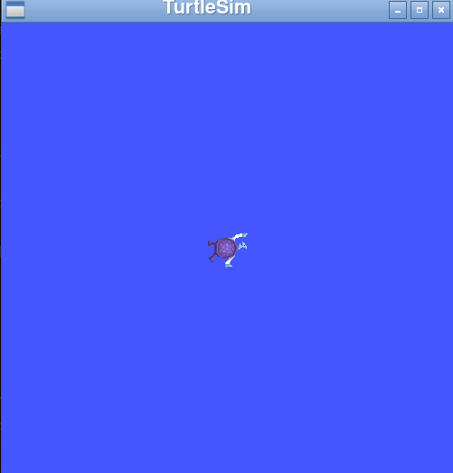

# pspad

Playstation like control pad to control turtlesim using roslibdart

## How to use it
### Start rosbridge
```
ros2 launch rosbridge_server rosbridge_websocket_launch.xml
```
### Start turtlesim in another terminal
```
ros2 run turtlesim turtlesim_node
```
### Start flutter control pad
```
cd pspad
flutter run -d linux
```

### Screenshot



### How to use the control pad
```
void initState() {
    ros = Ros(url: host);
    cmdVelTopic = Topic(
        ros: ros,
        name: '/turtle1/cmd_vel',
        type: "geometry_msgs/msg/Twist",
        reconnectOnClose: true,
        queueLength: 10,
        queueSize: 10);

    ros.connect();
    super.initState();
    Timer.periodic(const Duration(milliseconds: 200), directionFired);
}
void leftCallback(int event) {
    leftButtonState = event;
}
void directionFired(Timer timer) {
    var linear = {'x': 0.0, 'y': 0.0, 'z': 0.0};
    var angular = {'x': 0.0, 'y': 0.0, 'z': 0.0};
    if (leftButtonState == -1) {
      linear = {'x': 0.0, 'y': 0.0, 'z': 0.0};
      angular = {'x': 0.0, 'y': 0.0, 'z': turnAngularVelocity};
    } else if (rightButtonState == -1) {
      linear = {'x': 0.0, 'y': 0.0, 'z': 0.0};
      angular = {'x': 0.0, 'y': 0.0, 'z': -turnAngularVelocity};
    } else if (forwardButtonState == -1) {
      linear = {'x': forwardVelocity, 'y': 0.0, 'z': 0.0};
      angular = {'x': 0.0, 'y': 0.0, 'z': 0};
    } else if (backwardButtonState == -1) {
      linear = {'x': -forwardVelocity, 'y': 0.0, 'z': 0.0};
      angular = {'x': 0.0, 'y': 0.0, 'z': 0};
    }
    var twist = {'linear': linear, 'angular': angular};
    if (lastDirectionTwist == twist &&
        twist['linear'] == {'x': 0.0, 'y': 0.0, 'z': 0.0} &&
        twist['angular'] == {'x': 0.0, 'y': 0.0, 'z': 0.0}) {
      return;
    }

    cmdVelTopic.publish(twist);
    lastDirectionTwist = twist;
}
Center(
    // Center is a layout widget. It takes a single child and positions it
    // in the middle of the parent.
    child: Container(
        margin: const EdgeInsets.all(50),
        child: Row(
            mainAxisAlignment: MainAxisAlignment.spaceBetween,
            children: <Widget>[
                DirectionPad(
                    diameter: 200,
                    leftCallback: leftCallback,
                    rightCallback: rightCallback,
                    forwardCallback: forwardCallback,
                    backwardCallback: backwardCallback,
                ),
                KeyPad(
                    diameter: 200,
                    squareCallback: squareCallback,
                    circleCallback: circleCallback,
                    triangleCallback: triangleCallback,
                    crossCallback: crossCallback,
                ),
            ],
        ),
    )
),
```
